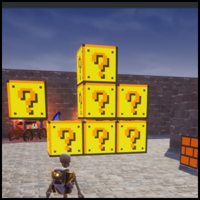

## Pixel Art Images -> Core Templates
---
&nbsp;

https://popthosepringles.github.io/Core-Image-To-Template/

&nbsp;

Creating Pixel Art in [Core](https://coregames.com) is a very time consuming process.  Currently you can't import images, so to create Pixel Art you need to use planes and painstakingly position each one.

With this tool you select an image (ideally pixel art, though higher resolution images will work), and a template will be generated for you that can be dropped into your templates folder.

We use a few methods to help with editor performance and runtime performance.

- Maximal Rectangle Algorithm
	
	Tries to merge rectangles of pixels of the same color together so that 1 pixel is not always 1 plane in the editor.  This is our editor solution to help reduce object count.

- Mesh Merge

	With the release of Mesh Merge, we can combine objects together so that at runtime they become 1 object.  We handle wrapping all the pixels (planes) in a mesh merge folder so that when you enter play mode the pixel art is reduced to 1 object.  This is great for runtime performance which now opens up the doors for pixel art style games.
---

## Examples

Below are a few examples of what can be done with the tool.

 
 